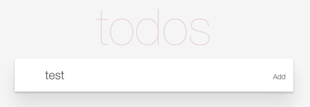
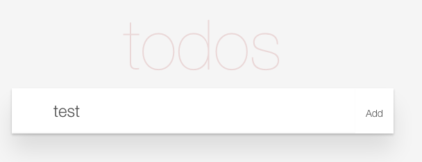
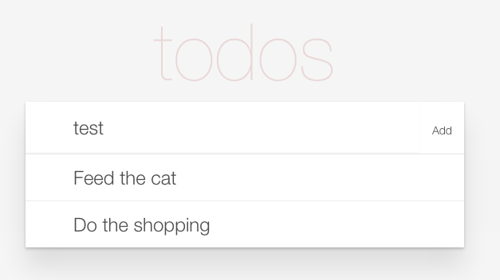
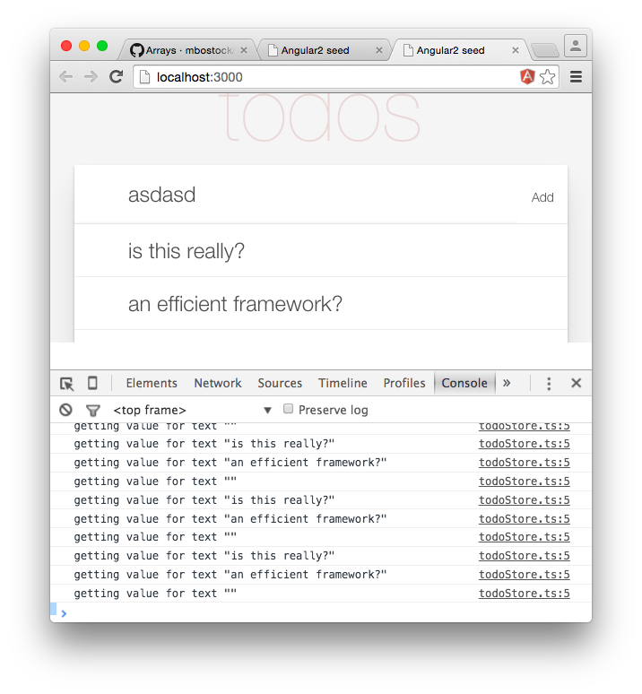

#An Angular 2.0 todo list application

##Getting Started

- Clone or download the repo
- Run `npm install`
- Run `gulp serve`

1.adding tasks:

2.done tasks.

3.delete task.

-------------------------------------------
           Detailed Description:
-------------------------------------------
#Introduction

This application aims to build a simple todo-list application with Angular 2.0 and type script. Along the way we’ll look at web components, dependency injection, TypeScript, bindings and the Angular 2.0 change detection strategy which combine to make a much more elegant framework to its predecessor.

#Starter Project

As a starting point for the project I used an Angular 2 seed project, which puts in place a simple gulp build that performs the required TypeScript compilation and has live-reloading. I added the basic skeleton of the todo application to this seed, which can be seen in this commit. Running gulp serve shows the following:

Taking a quick look at the various files in this project, the app/component/todolist folder contains the only component within the starter project, which is defined in todolist.ts:

import {Component} from 'angular2/core';

@Component({
  selector: 'todo-list',
  templateUrl: 'app/todolist/todolist.html',
  styleUrls: ['app/todolist/todolist.css']
})
export default class TodoList {
}

The above code imports the Component decorator. Decorators allow you to annotate classes with meta-data, in this case Angular is using the decorator to indicate that the TodoList class is an Angular component, with associated styles and templates.

(Note, you can of course use SaSS or Less instead of css, but that would require a further build step).

The project makes use of the SystemJS module loader, which is built on top of an ES6 module loader. Because browsers do not support ES6, the TypeScript compiler is configured to output JavaScript based on the ES5 specification, with a compatible module format. The net result is that the browser can resolve dependencies and load modules dynamically, although bundling is possible via the SystemJS Builder if you want to reduce the number of network requests.

The final piece required to make this application work is the bootstrapping, which is within boostrap.js:

import {bootstrap} from 'angular2/platform/browser';
import ToDoList from './todolist/todolist';

bootstrap(ToDoList);

This simply informs Angular that this component is the application root.

Web components
...............................

Binding 

1.Simple binding
Angular 2.0 bindings are quite simple, just add a property to your class:

export default class TodoList {
  newItem = 'test';
}

And bind it to a DOM element’s property as follows:

<input class="new-todo"  [value]="newItem">

Which gives the following:

2.Event binding

Binding events is just as simple as binding properties, by adding a function to the component:

export default class TodoList {
  newItem = 'test';

  addClicked() {
    console.log('Add clicked', this.newItem);
  }
}

This can be bound as follows:

<button class="add" (click)="addClicked()">Add</button>

3.Two-way binding
changes in the view are propagated back to the component and vice versa.

<input class="new-todo"  [value]="newItem" (input)="newItemChanged($event)">

The component can be updated to add this new event handler:

newItemChanged(event: KeyboardEvent): void {
  const target = <HTMLInputElement> event.target;
  this.newItem = target.value;
}

The $event variable is available as part of the template expression context and contains the object that describes the DOM event. The variable contains a reference to the element which fired the event, allowing access to the updated value. As a result, when the ‘Add’ button is clicked it now reports the correct text.

Local template variables

Rather than access the DOM element indirectly via an event, it is possible to obtain a more direct reference to it via a template variable. Updating the template as follows:

<input class="new-todo" placeholder="What needs to be done?" autofocus
      #todoInput [value]="newItem" (input)="newItemChanged(todoInput.value)">

The #todo-input creates a local template variable that is accessible on any child or sibling element. It is then referenced in the input event binding as todoInput. Notice that this is a de-normalised name, which is required because HTML is case insensitive.

With this code in place the component logic is simplified:
newItemChanged(value: string): void {
  this.newItem = value;
}

ngModel binding

You can add two-way binding to a DOM element via ngModel as follows:

<input class="new-todo"  [(ngModel)]="newItem">

Pseudo events

It would also be good if the application added todo items when the user hits enter. For this you can add a binding to the keyup event and filter based on the key that was pressed. Although Angular 2 simplifies this by providing pseudo-events which have a filter built in.

The following snippet shows how the addItem component method can be invoked when either the button is clicked, or the enter key pressed, via the keyup.enter pseudo event:

<input class="new-todo"  [(ngModel)]="newItem" (keyup.enter)="addItem()">
<button class="add" (click)="addItem()">Add</button>

Adding a store

Rather than adding a service, I’m going to borrow the store concept from the Flux pattern. Stores contain application state and perform logic based on actions that are dispatched from the view. I’ll not be adding actions or a dispatcher to this application, but will keep the logic and state within the store.

Here’s a very simple store with a hard-coded list of todo items:

export class TodoItem {
  text: String;
}

export class TodoStore {
  items: TodoItem[] = [
     {text: 'Feed the cat'},
     {text: 'Do the shopping'}
  ];
}

You can construct an instance of this store within the todo-list component, and expose it via a property:

import {TodoStore} from './../store/todoStore';

const store = new TodoStore();

@Component({ ... })
export default class TodoList {
  newItem = 'test';
  items = store.items;
}

These can then be rendered via the ngFor directive as follows:

<section class="main">
  <ul class="todo-list">
    <li *ngFor="#item of items">
      

        <label></label>
      

    </li>
  </ul>
</section>

Dependency Injection

Constructing an instance of the store directly within the component isn’t ideal, it is likely that we would want the store to be a singleton. This was one of the important features of Angular 1.x services. Angular 2.0 has a solution to this problem in the form of dependency injection.

Rather than constructing an instance of the store, the component can be changed to require a store via its constructor:

import {TodoStore} from './../store/todoStore';

@Component({ ... })
export default class ToDoList {
  newItem = 'test';
  store: TodoStore;

  constructor(store: TodoStore) {
    this.store = store;
  }
}

You can then let Angular take care of injecting a store instance. All you have to do is provide a the TodoStore class to the bootstrap:

import {bootstrap} from 'angular2/platform/browser';
import ToDoList from './component/todolist/todolist';
import {TodoStore} from './store/todoStore';

bootstrap(ToDoList, [TodoStore]);

Adding items

Now that we have a store we can actually start adding todo items to it. Removing the fake data and including a method for adding new items results in the following:

export class TodoStore {
  items: TodoItem[];

  constructor() {
    this.items = [];
  }

  addItem(newItem: String) {
    this.items.push({
      text: newItem
    });
  }
}

The component can now use the addItem method on the store to add new items, each time clearing the newItem property in order to clear the text input area:

addItem() {
  this.store.addItem(this.newItem);
  this.newItem = '';
}

Creating child components

The current application only has a single component, the root. More complex applications are likely to have numerous components, so in order to make this example a bit more realistic we’re going to refactor a little, adding a component that renders each individual todo item.

The HTML for the new component is quite simple:

  <label></label>

As is the component:

import {Component, Input} from 'angular2/core';
import {TodoItem as TodoItemModel} from './../store/todoStore';

@Component({
  selector: 'todo-item',
  templateUrl: 'app/todoitem/todoitem.html',
  styleUrls: ['app/todoitem/todoitem.css']
})
export default class TodoItem {
  @Input()
  item: TodoItemModel;
}

The one new concept here is the Input decorator, which indicates that the property is part of the components public API and can be bound to. Notice the aliased module import {TodoItem as TodoItemModel}, this is because I gave both the model / store object and component the same name, I’m still getting to grips with this pattern.

The component can be used as follows (after adding it to the directives property of the todo-list Component decorator):

<li *ngFor="#item of store.items">
  <todo-item [item]="item"></todo-item>
</li>

As a result of adding the Input decorator to the component’s item property it can now be bound to.

Adding a delete button

The current example shows how to pass data into a component instance, via a property binding, but how do you propagate changes in the other direction? If you consider the component to be just like any other DOM element, then it should expose events in order to indicate changes in state.

In order to illustrate this, the todo item template is updated to add a ‘delete’ button, with a click event binding:

  <label></label>
  <button (click)="doneClicked()" class="destroy"></button>

The component is updated to add an Output property which is an EventEmitter, with the doneClicked method firing this event:

import {Component, Input, Output, EventEmitter} from 'angular2/core';
import {TodoItem as TodoItemModel} from './../store/todoStore';

@Component({ ... })
export default class TodoItem {
  @Input()
  item: TodoItemModel;

  @Output()
  done = new EventEmitter();

  doneClicked() {
    this.done.next(this.item);
  }
}

The done event exposed by this component can then be bound to just like any other DOM element event:

<todo-item [item]="item"
  (done)="removeItem($event)">
</todo-item>

The todo list component handles this event and informs the store that the given item has been deleted.

As a result items can now be added or deleted from the list:

Change detection

Back to change detection, previously I mentioned that Angular 2 always propagates changes down from the root. What does this mean in practice? When the browser’s JavaScript engine executes any logic, (perhaps as a result of a timeout, DOM event or HTTP request), Zonejs ensures that the change detection logic is executed afterwards. This logic starts at the root component, checking for changes in state and re-rendering any whose state has changed.

You can actually see this process in action by detecting when the framework accesses the properties on your model objects.

By modifying the TodoItem class you can detect when the text property is read:

export class TodoItem {
  _text: String;

  get text() {
    console.log(`getting value for text "${this._text}"`);
    return this._text;
  }
  set text(value) {
    this._text = value;
  }

  constructor(text: String) {
    this._text = text;
  }
}

With the above logic in place, and a few items added to the todo list, you see a flood of console log messages every single time a key is pressed (within the todo input element):

Immutability

With Angular 2 each component has its own change detector, which allows you to choose from a number of change detection strategies on a per-component basis (in much the same way that individual components can choose their own encapsulation mode). One of the most interesting change detection strategies relates to immutability.

If the rendered state of a component only depends on its input properties (which should be the case), then if these properties have not changed from one VM turn to the next, then the component doesn’t need to be re-rendered.

In the current application the TodoItem model object is immutable, so we can take advantage of this feature. Selecting a strategy is as simple as adding a changeDetection property to the Component decorator:

import {ChangeDetectionStrategy} from 'angular2/core';

@Component({
  ...
  changeDetection: ChangeDetectionStrategy.OnPush
})
export default class TodoItem {
  ...
}

Now re-running the application, you should not see the getters for each todo item being accessed on each keystroke:

This is because the ChangeDetectionStrategy.OnPush strategy indicates the the inputs (via property bindings) to the TodoItem component are immutable. The change detector is able to determine that the property values have not changed between keypresses, and as a result it does not need to invoke the getters on the underlying model items to determine whether their state has changed.

The pluggable nature of the change detection strategy means that you can use different approaches to inform Angular of what has changed in order to optimise rendering.